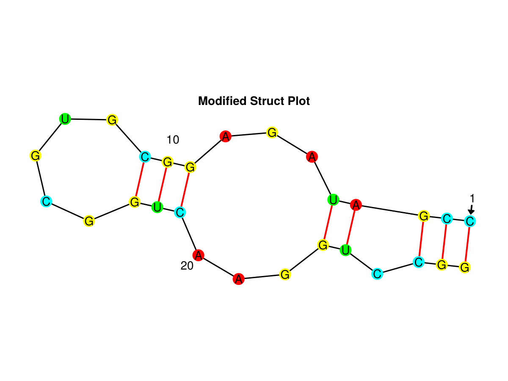

# Packacke Guide

## Installation

Currently `RNAStructPlot` is not available on the Julia Registry.

It can be added as Development Dependency via the `dev` command. Download the repository and put it inside the `.julia/dev` folder. Then add it inside the Pkg REPL-Mode

```
add RNAStructPlot
```

## Guide

`RNAStructPlot` provides a range of Visualizations for the [Secondary Structure of the RNA](https://en.wikipedia.org/wiki/Nucleic_acid_secondary_structure), written in Julia only. These can be displayed using the Plotting Framework [Makie](https://docs.makie.org/stable/).

The secondary structure can be read in dotbracket notation.
- unpaired bases `.` are marked as dots
- paired bases are marked with an opening `(` and closing `)` bracket

Usually the dotbracket notation is handed over with the corresponding rna sequence.

```julia
using RNAStructPlot

sequence = "CGCUUCAUAUAAUCCUAAUGAUAUGGUUUGGGAGUUUCUACCAAGAGCCUUAAACUCUUGAUUAUGAAGUG"
notation = "...(((((((..((((((.........))))))......).((((((.......))))))..))))))..."
rnastruct = Parse.dotbracketbase(sequence, notation)
```

The created structure `rnastruct` will be available for all visualizations types.

```julia
f = Figure()
ax = Axis(f[1,1], title="Modified Struct Plot", aspect=DataAspect())

Recipes.structureplot!(f[1,1], rnastruct, layout=:modified)

hidedecorations!(ax)
hidespines!(ax)

f
```

