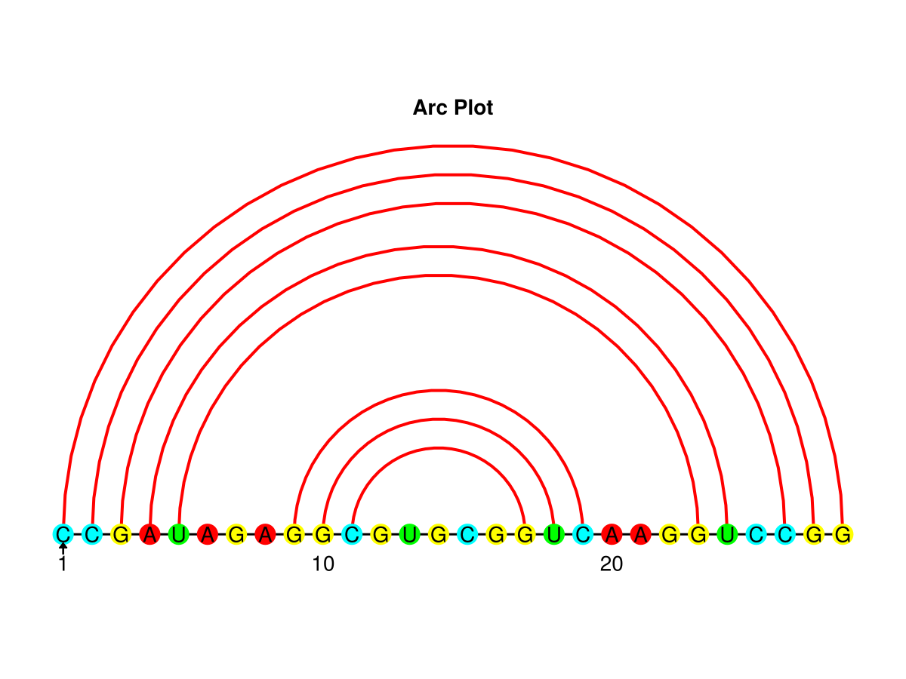
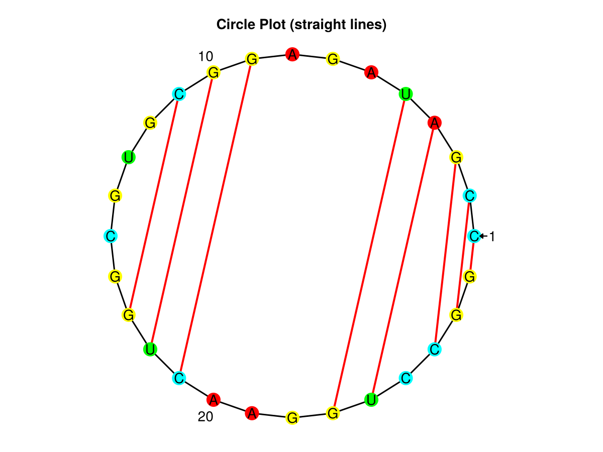
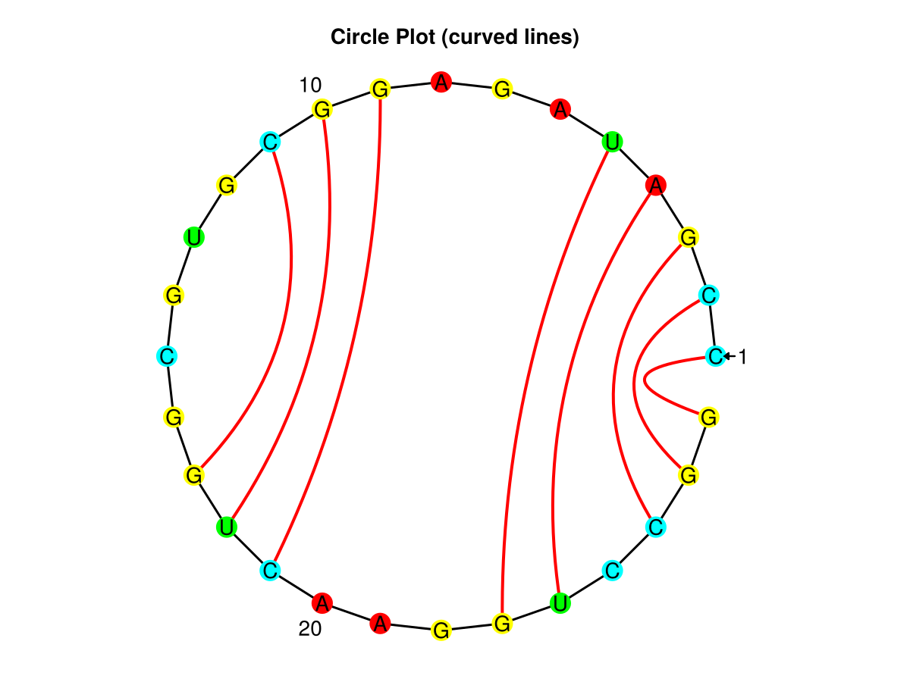

# Diagram Types

`RNAStructPlot` provides following plot types for the secondary structure of the RNA.

## Arc Diagram

```julia
f = Figure()
ax = Axis(f[1,1], title="Arc Plot", aspect=DataAspect())

Recipes.arcplot!(f[1,1], rnastruct)

hidedecorations!(ax)
hidespines!(ax)

f
```


## Circular Diagram

Nucleotides are layed out on a circle with equal distance to their neighbors. Hydrogen bonds are drawn as straight lines between base pairs.

```julia
f = Figure()
ax = Axis(f[1,1], title="Circle Plot (straight lines)", aspect=DataAspect())

Recipes.circleplot!(f[1,1], rnastruct)

hidedecorations!(ax)
hidespines!(ax)

f
```


The circular drawing can be modified. Instead of straight lines, bonds are drawn as bezier curves of second order.

```julia
f = Figure()
ax = Axis(f[1,1], title="Circle Plot (curved lines)", aspect=DataAspect())

Recipes.circleplot!(f[1,1], rnastruct, layout=:curves)

hidedecorations!(ax)
hidespines!(ax)

f
```


## Polygonal Overlapping Layout

Loops are drawn as regular polygons with attached stems as rectangles.

```julia
f = Figure()
ax = Axis(f[1,1], title="Polygonal Struct Plot", aspect=DataAspect())

Recipes.structureplot!(f[1,1], rnastruct, layout=:polygonal)

hidedecorations!(ax)
hidespines!(ax)

f
```


## Non Overlapping Layout

Using the polygon methode can have its problems. Sometimes the resulting drawing contains crossing/overlaps. The modified version provides a fallback, which guarantees a drawing without crossing/overlaps.

```julia
f = Figure()
ax = Axis(f[1,1], title="Modified Struct Plot", aspect=DataAspect())

Recipes.structureplot!(f[1,1], rnastruct, layout=:modified)

hidedecorations!(ax)
hidespines!(ax)

f
```

